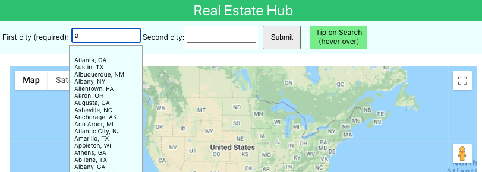
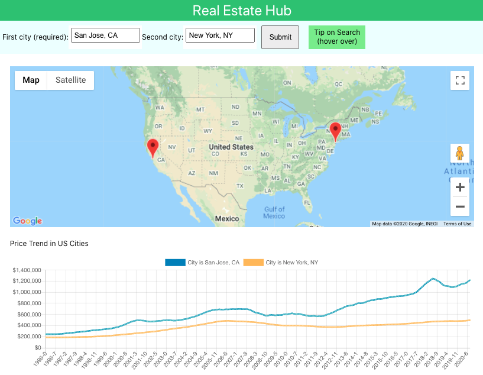
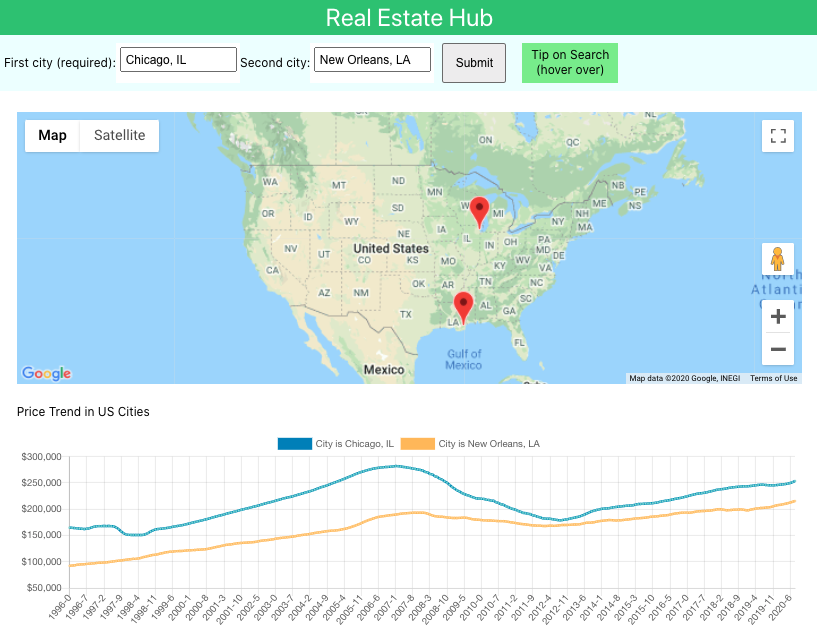

# Real Estate Hub

About the app: it is a real-estate hub, providing insights such as home-price trend in the United States.

## 1. Front End

Note that front end's folder name is 'src' (instead of 'client'). This is due to create-react-app's constraint.

### Bootstrapped with create-react-app

This project was bootstrapped with [create-react-app](https://github.com/facebook/create-react-app).

I decided Not to update my repo from 2018 (via webpack). Instead, I started a new repo via create-react-app. This is due to the high efforts to update the legacy codes (e.g. node's v8 VS v14).

### Auto-Suggestion for Search Bar

Based on this npm package, [react-autosuggest](https://www.npmjs.com/package/react-autosuggest). The advantages of providing auto-suggestion feature include less effort to type the full name of each city.

### Map Component: via react-google-maps Module

This component/module is difficult to configure.

First, `<GoogleMap>` component needs API key in the endpoint (`https://maps.googleapis.com/maps/api/js`), in order to display the map properly.

Below are some issues that I ran into. The details are in Map.js file. But on the bright side, these issues are relatively minor.

- Markers cannot be re-rendered without refreshing the page (AKA `GoogleMap` from `react-google-maps` module simply does not remove any marker, once added).
  - First, I converted this component from a function to a class (with `componentDidUpdate()`), but it did not work.
  - Then, I looked into [its API doc](https://developers.google.com/maps/documentation/javascript/examples/marker-remove), but found its logic to be not helpful for React (more for Vanilla JS).
- Cannot dynamically set `defaultZoom` for `<GoogleMap>`.
  - I wrote a helper function, getDefaultZoom(), that zooms in if the 2 geo-markers are close by. But it did not work (the map component simply does not update, once mounted
  - Therefore, I just set the default zoom as showing entire country of the US.

### Line Charts

Based on these 2 npm packages, chart.js and react-chartjs-2. The advantages of using these packages include beautiful data visualization for large set of data points (i.e. monthly price data, for 20+ years).

Note that [Google Charts](https://www.w3schools.com/howto/howto_google_charts.asp) is an alternative way to plot charts.

## 2. Back End

### 2(a). Server: Express

A proxy (in package.json) is set up, to connect Express's back end with create-react-app's front end. `"proxy": "http://localhost:8000"`

Also, some adjustments were made in server/index.js. `app.use(express.static(path.join(__dirname, "../build"))); `

### 2(b). Database: MongoDB

I made the decision to use MongoDB, because this NoSQL DB is quite native to Javascript (.js). On the flip side, MySQL DB (.sql, not .js) has too many security constraints (e.g. command line issue, when importing a CSV file)

### 2(c). Service: Google Maps' Geocode API

Endpoint: `https://maps.googleapis.com/maps/api/geocode/json`

Note that this API service (together with the other one above) are no longer free (it was back in 2018).

Once a user clicks on submit for a city, the server will process the GET request and send a service call to this endpoint of Google Maps'.

## 3. Data Source

A challenge for building this app is finding free and good-quality API (for data). Zillow is the only free source for real-estate data. Therefore, I decided to use Zillow.

### API VS CSV file:

Originally, I tried to use [Zillow's API](https://www.zillow.com/howto/api/APIOverview.htm). Unfortunately, region-level data is not available (only property-level data is available). Therefore, I switched to downloading a big CSV file from Zillow's site.

### Data Conversion: CSV to JSON

For some reason, [module csvtojson](https://www.npmjs.com/package/csvtojson) did not work with my 2018's repo. On the other hand, it did work when I tested this module on its own (created a folder with only: this module, a simple CSV file, and a simple test JS file). Therefore, I decided to update everyting (incl. create-react-app, node version), for this key module to work.

### Data Processing

The region-level data needs to be processed (e.g. re-shaped/cleaned), before loading it to the database. For details, refer to the file /database-mongo/processData.js.

## 4. Development

- Install dependencies: `npm start`
- Run the app: `npm start`; then open [http://localhost:3000](http://localhost:3000) to view it in the browser. Also, any lint errors will be shown in the console.
- Credentials (e.g. API key): stored at 2 files below (consider consolidating to `.env` file only, in the future)
  - (1) `config.js`: it is used for all files except client side's. Because there is security risk to expose this file under client's directory `src/`.
  - (2) `.env`: this env variable is used, for the exception that `Map.jx` component (its `googleMapURL` requries API key in the string, in order to load the map)

## 5. Screenshots

#### Auto-Suggestion

#### For Analysis (Cross-Region)

